<div align="center">

<!-- Animated Header -->


<!-- Typing Animation -->
<a href="https://git.io/typing-svg"></a>

<!-- Profile Badges -->
<br/>


[](https://torka.tech)
[](https://salauddin.co.uk)
[](https://www.linkedin.com/in/salauddinx/)
[](mailto:info@salauddin.co.uk)

</div>

---

## 🧑‍💻 About Me

```yaml
name: Muhammad Sala Uddin
location: "🇬🇧 United Kingdom"
current_role: "Full-Stack Developer & SaaS Architect"
company: "Torka Tech Limited"
website: "https://torka.tech"
education: "Self-taught Developer & Continuous Learner"

currently_building:
  - "Torka.tech — AI Website Builder Platform"
  - "AI-Powered Recruitment & Applicant Matching System"
  - "Freelance Marketplace (Django + React)"
  - "Automation-first SaaS Products"

passions:
  - "Turning complex problems into elegant solutions"
  - "Building systems that scale"
  - "AI & Machine Learning integration"
  - "Music Production 🎵"

daily_routine:
  morning: "☕ Coffee + Code Review"
  afternoon: "🏗️ Building Features & Systems"
  evening: "📚 Learning & Experimenting"
  night: "🎵 Music Production & Creative Work"
```

---

## 🔭 What I'm Currently Working On

<table>
<tr>
<td width="50%">

### 🤖 AI Recruitment SaaS
> An intelligent applicant matching system that uses AI to connect the right candidates with the right opportunities — faster, smarter, and more accurately.
>
> **Stack:** Django REST · React · PostgreSQL · AI/ML

</td>
<td width="50%">

### 🛒 Freelance Marketplace
> A full-featured marketplace connecting freelancers with clients globally, featuring secure payments, real-time chat, and project management tools.
>
> **Stack:** Django · React · Stripe · WebSockets

</td>
</tr>
<tr>
<td width="50%">

### ⚙️ Automation Agency Platform
> End-to-end business automation platform that streamlines operations, CRM, invoicing, and client management for agencies.
>
> **Stack:** Python · Node.js · REST APIs · Cron Jobs

</td>
<td width="50%">

### 🌍 Torka.tech — AI Website Builder
> An AI-powered website builder that lets anyone create stunning, professional websites in minutes — no coding required. Smart templates, AI content generation, and one-click deployment.
>
> **Stack:** Django · React · AI/ML · Tailwind CSS · Stripe

</td>
</tr>
</table>

---

## 🛠️ Tech Stack & Tools

<div align="center">

### 👨‍💻 Languages


### 🔧 Backend & Frameworks


### 🎨 Frontend & UI


### 🗄️ Databases & Storage


### ☁️ DevOps & Cloud


### 🧰 Tools & Platforms


</div>

---

## 🌱 Currently Learning & Exploring

<div align="center">

| 🧠 Area | 📖 Focus |
|---|---|
| **System Architecture** | Microservices, Event-Driven Design, Domain-Driven Design |
| **AI & Machine Learning** | NLP, Recommendation Engines, LLM Integration |
| **Scalable Infrastructure** | Kubernetes, Load Balancing, Auto-scaling |
| **Security** | OAuth 2.0, JWT Best Practices, Penetration Testing |
| **DevOps & CI/CD** | GitHub Actions, Docker Compose, Blue-Green Deployments |
| **Performance** | Caching Strategies, Query Optimization, CDN Architecture |

</div>

---

## 💬 Ask Me About

<div align="center">

```
╔══════════════════════════════════════════════════════════════════════╗
║                                                                      ║
║   �  Torka.tech — AI Website Builder Platform                       ║
║   �🐍  Python (Django, DRF, FastAPI, Automation Scripts)              ║
║   ⚛️  React Frontend Architecture & State Management                 ║
║   🖥️  VPS Deployment, Server Setup & Production Configs              ║
║   🤖  AI Matching Logic & Recommendation Systems                     ║
║   🏢  Business Automation & CRM Systems                              ║
║   🌐  International Trade & E-Commerce Platforms                     ║
║   🗄️  Database Design & Optimization (SQL & NoSQL)                   ║
║   🔒  API Security, Authentication & Authorization                   ║
║   📦  SaaS Product Architecture & Multi-tenancy                      ║
║   🚀  Startup Tech Strategy & MVP Development                        ║
║                                                                      ║
╚══════════════════════════════════════════════════════════════════════╝
```

</div>

---

## 👯 Open to Collaborate On

<div align="center">

🤖 **AI-Based Platforms** — Intelligent systems that solve real problems  
🚀 **SaaS Startups** — From MVP to production-grade products  
🛒 **Marketplace Systems** — Multi-vendor, payments, logistics  
⚙️ **Automation & CRM** — Streamline business operations  
🌍 **Open Source Projects** — Contributing to the dev community  
💡 **Innovative Ideas** — If it's bold and impactful, let's talk  

</div>

---

## 📈 2026 Goals & Roadmap

```mermaid
graph LR
    A[🚀 Q1 2026] --> B[🛒 Q2 2026]
    B --> C[⚙️ Q3 2026]
    C --> D[🌍 Q4 2026]
    
    A --- A1[Launch Torka.tech AI Builder]
    A --- A2[Launch AI Recruitment SaaS]
    B --- B1[Complete Freelance Marketplace]
    B --- B2[Integrate Payment Systems]
    C --- C1[Build Automation Agency Platform]
    C --- C2[Scale to 1000+ Users]
    D --- D1[Expand Global Remote Projects]
    D --- D2[Open Source Contributions]
```

<div align="center">



</div>

| Quarter | Goal | Status |
|---------|------|--------|
| 🚀 **Q1** | Launch Torka.tech AI Website Builder | 🟡 In Progress |
| 🤖 **Q1** | Launch AI Recruitment SaaS to production | 🟡 In Progress |
| 🛒 **Q2** | Complete & deploy Freelance Marketplace | 🔵 Planning |
| ⚙️ **Q3** | Build Automation-first Agency Systems | 🔵 Planning |
| 🌍 **Q4** | Scale globally & contribute to Open Source | 🔵 Planning |
| 🎯 **Ongoing** | Learn, build, ship, repeat | 🟢 Always Active |

---

## 🎵 Beyond Code

<div align="center">

> *When I'm not writing code, you'll find me...*

🎵 **Producing Music** — Beats, melodies, and digital soundscapes  
📚 **Reading** — Business strategy, tech architecture, and psychology  
✈️ **Exploring** — New places, cultures, and perspectives  
🧠 **Learning** — There's always something new to master  
☕ **Caffeinating** — Good code starts with great coffee  

</div>

---

## 📫 Let's Connect & Build Together

<div align="center">

[](https://torka.tech)
[](https://salauddin.co.uk)
[](mailto:info@salauddin.co.uk)
[](https://www.linkedin.com/in/salauddinx/)
[](https://github.com/salauddinx)

<br/>

### 💡 *Got an idea? Let's make it real.*

<br/>


</div>

---

<div align="center">


**⭐ If you like what I do, consider giving my repos a star! ⭐**

*Made with ❤️ and ☕ by Muhammad Sala Uddin*

</div>
